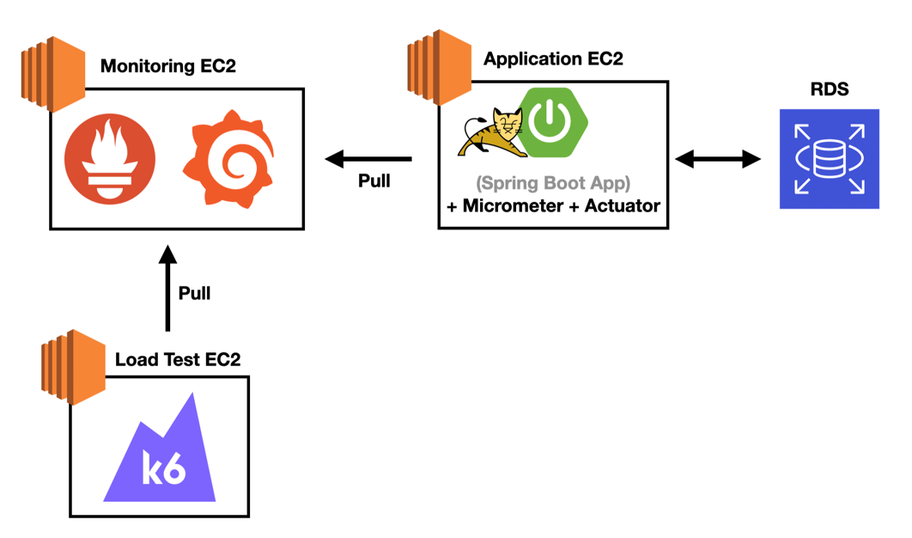

# 📦 의존성 구조 및 책임 기반 설치 라이브러리 분류

## ✅ 설계 목적

- 기능별 책임 단위로 라이브러리를 명확히 분리하였습니다.
- 각 라이브러리의 설치 용량을 분석하여, EC2 인스턴스 사양 선정과 불필요한 리소스 낭비를 방지합니다.

### 프로메테우스

prometheus-3.4.0.darwin-amd64.tar.gz
약 113mb

약(0.25mb)

- micrometer-registry-prometheus: 0.039890289306640625 MB
- prometheus-metrics-core: 0.0911273956298828125 MB
- prometheus-metrics-tracer-common: 0.0031280517578125 MB
- prometheus-metrics-model: 0.08669948577880859375 MB
- prometheus-metrics-config: 0.03167629241943359375 MB

### 그라파나

12.0.1
약 833mb

---

## 🧱 운영 목적/기능 기준 분류

### 📌 [필수 웹 기능 구성] (총 약 7.0MB)

**spring-boot-starter-web 기반**

- spring-web (1.99MB)
- spring-webmvc (1.04MB)
- tomcat-embed-core (3.45MB)
- tomcat-embed-el (0.25MB)
- tomcat-embed-websocket (0.27MB)

---

### 🗃️ [데이터 관리 및 저장소 연동] (총 약 16.0MB)

**spring-boot-starter-data-jpa 기반**

- spring-data-jpa (1.68MB)
- spring-data-commons (1.44MB)
- hibernate-core (11.50MB)
- spring-orm (0.22MB)
- spring-jdbc (0.45MB)
- spring-tx (0.27MB)
- HikariCP (0.15MB)
- jakarta.persistence-api (0.16MB)
- jboss-logging (0.06MB)

**mysql 드라이버**

- mysql-connector-j (2.48MB)

---

### 🔐 [보안 및 인증] (총 약 5.5MB)

**spring-boot-starter-security 기반**

- spring-security-core (0.58MB)
- spring-security-config (1.93MB)
- spring-security-web (0.95MB)
- spring-security-crypto (0.10MB)
- thymeleaf-extras-springsecurity6 (0.05MB)

**jjwt 기반**

- jjwt (0.00MB)
- jjwt-api (0.13MB)

**jackson (jjwt-jackson 포함)**

- jackson-databind (1.58MB)
- jackson-annotations (0.07MB)
- jackson-core (0.57MB)
- jackson-datatype-jdk8 (0.03MB)
- jackson-datatype-jsr310 (0.13MB)
- jackson-module-parameter-names (0.01MB)

---

### ✅ [입력 유효성 및 예외 대응] (총 약 1.3MB)

**spring-boot-starter-validation 기반**

- hibernate-validator (1.27MB)
- jakarta.validation-api (0.09MB)

---

### 📖 [문서화 및 개발 편의] (총 약 4.2MB)

**springdoc-openapi-starter-webmvc-ui 기반**

- springdoc-openapi-starter-webmvc-ui (0.02MB)
- springdoc-openapi-starter-webmvc-api (0.04MB)
- springdoc-openapi-starter-common (0.48MB)
- swagger-ui (2.97MB)
- swagger-core-jakarta (0.22MB)
- swagger-models-jakarta (0.13MB)
- swagger-annotations-jakarta (0.05MB)

---

### 🛠️ [배포/운영/관측] (총 약 2.5MB)

**spring-boot-starter-actuator 기반**

- spring-boot-actuator (0.67MB)
- spring-boot-actuator-autoconfigure (0.79MB)
- micrometer-core (0.83MB)
- micrometer-observation (0.07MB)
- micrometer-jakarta9 (0.03MB)
- micrometer-commons (0.05MB)

---

### ☁️ [클라우드 연동] (총 약 9.0MB)

**spring-cloud-starter-aws 기반**

- spring-cloud-starter-aws (0.00MB)
- spring-cloud-aws-context (0.08MB)
- spring-cloud-aws-autoconfigure (0.03MB)
- spring-cloud-aws-core (0.06MB)

**AWS SDK 구성**

- aws-java-sdk-core (0.97MB)
- aws-java-sdk-s3 (1.01MB)
- aws-java-sdk-ec2 (5.54MB)
- aws-java-sdk-kms (0.56MB)
- aws-java-sdk-cloudformation (0.78MB)
- jmespath-java (0.03MB)

---

### 📊 [QueryDSL 기반 정적 쿼리] (총 약 3.5MB)

**querydsl-jpa 기반**

- querydsl-jpa (0.13MB)
- querydsl-core (0.46MB)
- querydsl-apt (0.06MB)
- querydsl-codegen (0.09MB)
- mysema-commons-lang (0.01MB)
- codegen-utils (0.07MB)
- ecj (2.99MB)

---

### 💻 [개발 생산성 도구] (총 약 3.2MB)

**lombok 및 로깅 구성**

- lombok (1.96MB)
- logback-core (0.59MB)
- logback-classic (0.29MB)
- log4j-to-slf4j (0.02MB)
- log4j-api (0.33MB)
- jul-to-slf4j (0.01MB)
- slf4j-api (0.07MB)

**기타**

- spring-boot-configuration-processor (0.13MB)

---

### 🧩 [기초 API 및 유틸성 구성] (총 약 5.0MB 이상)

**spring-boot-starter-thymeleaf 기반**

- thymeleaf (0.90MB)
- thymeleaf-spring6 (0.18MB)
- attoparser (0.24MB)
- unbescape (0.17MB)

**jackson 기타 모듈**

- jackson-dataformat-cbor (0.07MB)
- jackson-dataformat-yaml (0.05MB)
- snakeyaml (0.33MB)

**jakarta / javax API**

- jakarta.annotation-api (0.02MB)
- jakarta.transaction-api (0.03MB)
- jakarta.activation-api (0.06MB)
- jakarta.xml.bind-api (0.12MB)
- javax.inject (0.00MB)

**직접 의존 또는 하위 의존**

- aspectjweaver (2.08MB) *(from spring-boot-starter-aop)*
- classgraph (0.53MB) *(from springdoc-openapi-starter-common)*
- classmate (0.07MB) *(from hibernate-validator)*
- antlr4-runtime (0.31MB) *(from hibernate-core)*
- commons-lang3 (0.64MB) *(from aws-java-sdk-core or springdoc-openapi)*
- commons-codec (0.36MB) *(from aws-java-sdk-core or httpclient)*
- httpclient (0.74MB) *(from aws-java-sdk-core)*
- httpcore (0.31MB) *(from httpclient)*
- ion-java (0.54MB) *(from aws-java-sdk-kms)*
- joda-time (0.59MB) *(from springdoc-openapi or swagger-core)*
- webjars-locator-lite (0.01MB) *(from springdoc-openapi-ui)*
- jspecify (0.00MB) *(from jackson or nullable annotations)*

---

## 🔍 총 설치 용량 요약

- 전체 설치 아티팩트 용량: **약 70~80MB**
- EC2 디스크 사용량 고려 시:
    - Swagger 제거 시: **약 4MB 절감**
    - AWS SDK 제외 시: **약 9MB 절감**
    - QueryDSL 제외 시: **약 3.5MB 절감**

---

## 💡 설계 메시지

- **기능 목적별 모듈화된 아키텍처**로 각 라이브러리의 책임 명확화
- **설치 용량 기반 분석**을 통해 EC2 비용, 빌드 속도 최적화 가능
- 면접/코드 리뷰 시, **운영 최적화까지 고려하는 설계 인사이트** 강조
